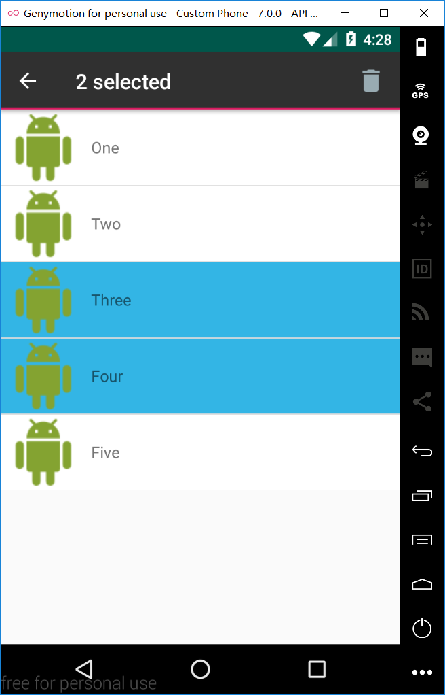

# Charpter3
安卓移动开发实验3 - UI组件

程序主界面：


## 3-1 Android ListView的用法
### 关键代码
```
public class FirstActivity extends AppCompatActivity {
    String [] animalname=new String[]{"Lion","Tiger","Monkey","Dog","Cat","Elephant"};
    int [] images = new int[] {R.drawable.lion,R.drawable.tiger,R.drawable.monkey,R.drawable.dog,R.drawable.cat,R.drawable.elephant};
    @Override
    protected void onCreate(Bundle savedInstanceState) {
        super.onCreate(savedInstanceState);
        setContentView(R.layout.activity_first);
        //创建List合集，元素是Map
        List<Map<String,Object>> listItems=new ArrayList<Map<String,Object>>();
        for(int i=0;i<animalname.length;i++)
        {
            Map<String,Object> listItem=new HashMap<String,Object>();
            listItem.put("name",animalname[i]);
            listItem.put("image",images[i]);
            listItems.add(listItem);
        }
        //创建SimpleAdapter
        SimpleAdapter sim=new SimpleAdapter(this,listItems,R.layout.simple_item,
                new String[] {"name","image"},
                new int[]{R.id.name ,R.id.header});
        ListView l=(ListView)findViewById(R.id.listView);
        l.setAdapter(sim);
        //选中目标
        l.setOnItemClickListener(new AdapterView.OnItemClickListener(){
            public void onItemClick(AdapterView parent, View view, int position, long id){
                Toast.makeText(FirstActivity.this,animalname[position],Toast.LENGTH_LONG).show();
            }
        });
    }
}
```
### 实验截图：


## 3-2 创建自定义布局的AlertDialog
### 关键代码：
```
public class SecondActivity extends AppCompatActivity {
    private Button button;
    @Override
    protected void onCreate(Bundle savedInstanceState) {
        super.onCreate(savedInstanceState);
        setContentView(R.layout.activity_second);
        button = (Button) findViewById(R.id.button);

        LayoutInflater inflater=SecondActivity.this.getLayoutInflater();
        View v= inflater.inflate(R.layout.alert_dialog,null,false);
        Context context=SecondActivity.this;
        AlertDialog.Builder builder = new AlertDialog.Builder(context);
        builder.setView(v);
        final AlertDialog alertDialog=builder.create();
        button.setOnClickListener(new View.OnClickListener(){
            @Override
            public void onClick(View v){
                alertDialog.show();
            }
        });

        v.findViewById(R.id.cancel).setOnClickListener(new View.OnClickListener() {
            @Override
            public void onClick(View view) {
                Toast.makeText(SecondActivity.this,"CANCEL",Toast.LENGTH_LONG).show();
                alertDialog.dismiss();
            }
        });
        v.findViewById(R.id.signin).setOnClickListener(new View.OnClickListener() {
            @Override
            public void onClick(View view) {
                Toast.makeText(SecondActivity.this,"SIGN IN",Toast.LENGTH_LONG).show();
                alertDialog.dismiss();
            }
        });
    }
}
```
### 实验截图：


## 3-3 使用XML定义菜单
### 关键代码
```
package com.example.tired.charpter3;

import android.app.AlertDialog;
import android.content.DialogInterface;
import android.graphics.Color;
import android.os.Bundle;
import android.support.v7.app.AppCompatActivity;
import android.view.Menu;
import android.view.MenuItem;
import android.widget.TextView;
import android.widget.Toast;

public class ThirdActivity extends AppCompatActivity {
    private  TextView textID;
    @Override
    protected void onCreate(Bundle savedInstanceState) {
        super.onCreate(savedInstanceState);
        setContentView(R.layout.activity_third);
        textID = (TextView)findViewById(R.id.textView);
    }
    @Override
    public boolean onCreateOptionsMenu(Menu menu) {
        menu.add(1,001,1,"字体大小");
        menu.add(1,002,2,"普通菜单项");
        menu.add(1,003,3,"字体颜色");
        return super.onCreateOptionsMenu(menu);
    }

    @Override
    public boolean onOptionsItemSelected(MenuItem item) {
        int id=item.getItemId();
        switch (id){
            case 001:
                final AlertDialog.Builder builder=new AlertDialog.Builder(this);
                builder.setTitle("设置字体大小");
                builder.setSingleChoiceItems(new String[]{"10号字体","16号字体","20号字体"},-1,new DialogInterface.OnClickListener(){
                    @Override
                    public void onClick(DialogInterface dialogInterface, int i) {
                        switch (i){
                            case 0:textID.setTextSize(10);
                                dialogInterface.dismiss();
                                break;
                            case 1:textID.setTextSize(16);
                                dialogInterface.dismiss();
                                break;
                            case 2:textID.setTextSize(20);
                                dialogInterface.dismiss();
                                break;
                        }
                    }
                });
                builder.setNegativeButton("取消",null);
                builder.show();
                break;
            case 002:
                Toast.makeText(this,"你点击了普通菜单项", Toast.LENGTH_LONG).show();
                break;
            case 003:
                final AlertDialog.Builder builder2=new AlertDialog.Builder(this);
                builder2.setTitle("设置字体颜色");
                builder2.setSingleChoiceItems(new String[]{"红色","黑色"},-1,new DialogInterface.OnClickListener(){
                    @Override
                    public void onClick(DialogInterface dialogInterface, int i) {
                        switch (i){
                            case 0:textID.setTextColor(Color.RED);
                                dialogInterface.dismiss();
                                break;
                            case 1:textID.setTextColor(Color.BLACK);
                                dialogInterface.dismiss();
                                break;
                        }
                    }
                });
                builder2.setNegativeButton("取消",null);
                builder2.show();
                break;
        }
        return super.onOptionsItemSelected(item);
    }
}
```
### 实验截图：


## 3-4 创建上下文操作模式(ActionMode)的上下文菜单
### 关键代码：
```
package com.example.tired.charpter3;

import android.os.Bundle;
import android.support.v7.app.AppCompatActivity;
import android.view.ActionMode;
import android.view.Menu;
import android.view.MenuInflater;
import android.view.MenuItem;
import android.view.View;
import android.widget.AdapterView;
import android.widget.ListView;
import android.widget.SimpleAdapter;

import java.util.ArrayList;
import java.util.HashMap;
import java.util.List;
import java.util.Map;

public class LastActivity extends AppCompatActivity {

    String [] number = new String[]{"One", "Two", "Three", "Four", "Five" };

    private ActionMode.Callback mAMC = new ActionMode.Callback(){
        public boolean onPrepareActionMode(ActionMode mode, Menu menu) {
            return false;
        }

        @Override
        public void onDestroyActionMode(ActionMode mode) {
            // TODO Auto-generated method stub
        }

        @Override
        public boolean onCreateActionMode(ActionMode mode, Menu menu) {
            MenuInflater inflater = mode.getMenuInflater();
            inflater.inflate(R.menu.context_menu, menu);
            return true;
        }

        @Override
        public boolean onActionItemClicked(ActionMode mode, MenuItem item) {
            boolean ret = false;
            if (item.getItemId() == R.id.menu_delete) {
                mode.finish();
                ret = true;
            }
            return ret;
        }
    };


    @Override
    protected void onCreate(Bundle savedInstanceState) {
        super.onCreate(savedInstanceState);
        setContentView(R.layout.activity_last);

        //创建List合集，元素是Map
        List<Map<String,Object>> listItems=new ArrayList<Map<String,Object>>();
        for(int i=0;i<number.length;i++)
        {
            Map<String,Object> listItem=new HashMap<String,Object>();
            listItem.put("title",number[i]);
            listItem.put("image",R.drawable.leftpic);
            listItems.add(listItem);
        }
        //创建SimpleAdapter
        final SimpleAdapter sim=new SimpleAdapter(this,listItems,R.layout.last_item,
                new String[] {"title","image"},
                new int[]{R.id.textID ,R.id.leftPic});
        final ListView l=(ListView)findViewById(R.id.listView);
        l.setAdapter(sim);

        l.setChoiceMode(ListView.CHOICE_MODE_MULTIPLE_MODAL);
        l.setOnItemClickListener(new AdapterView.OnItemClickListener(){
            public void onItemClick(AdapterView parent, View view, int position, long id){
                view.setSelected(true);
                ActionMode m1 = startActionMode(mAMC);
                m1.setTitle((position+1)+" selected");
            }
        });
    }
}

```
### 实验截图：


